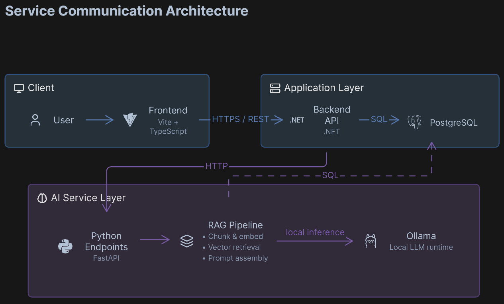

# local-rag-app

<p align="center">
  
  
  
  
  
  
  
  
</p>


**local-rag-app** is a fully local, fully free retrieval-augmented generation (RAG) system that answers natural-language questions about the Constitution of the Republic of Moldova, with every citation traceable back to a specific article. Retrieval, and generation run on the local machine, with generation accelerated on GPU via Ollama.

## Architecture Overview

<p align="center">
  
</p>

<p align="center">
  A user's browser talks to a .NET API, which delegates all retrieval and generation work to a Python FastAPI service. The Python service embeds the query, retrieves the closest article chunks from Postgres via pgvector, and generates a cited answer using a local Ollama model running on GPU.
</p>

## What The Project Includes

- **Ingestion pipeline** — extracts and chunks the source legal document by article, embeds each chunk locally, and stores it in Postgres with a vector column.
- **Python AI service (FastAPI)** — exposes `/retrieve`, `/generate`, and `/ask` endpoints; owns all embedding, vector search, and LLM calls.
- **.NET backend** — owns routing, request validation, authentication, and per-user chat history; delegates AI work to the Python service over HTTP.
- **React (Vite/TS) frontend** — chat interface with streaming responses and source citations.
- **Local LLM via Ollama** — GPU-accelerated generation with zero API cost and no external network dependency.

## Core Capabilities

- Semantic search over legal text using locally-generated embeddings (`sentence-transformers`).
- Answer generation grounded strictly in retrieved context, with article-level citations.
- Authenticated chat with persisted conversation history.
  
## Tech Stack

- Backend: .NET 8+, ASP.NET Core
- AI runtime: Python 3.14+, FastAPI, sentence-transformers, Ollama
- Frontend: React, TypeScript, Vite
- Data: PostgreSQL with the pgvector extension
- Local orchestration: Docker Compose
- LLM: Llama 3.1 8B

## Quick Start

### Prerequisites

- Docker Desktop (with WSL2 backend on Windows; NVIDIA GPU passthrough recommended for faster generation)
- .NET 8+ SDK, if running the backend outside Docker
- Node.js 20+, if running the frontend outside Docker
- Python 3.14+, if running the ingestion/AI service outside Docker

### Recommended Local Startup

Docker Compose is the source of truth for the local topology and starts the full stack.

```bash
docker compose up -d --build
```

This provisions:

- PostgreSQL with pgvector
- Ollama (GPU-accelerated local LLM)
- Python AI service (FastAPI)
- .NET backend
- React frontend

### Manual Startup

Use this only when working on an isolated part of the stack.

```bash
cd ingestion
python -m venv .venv
source .venv/bin/activate      # .venv\Scripts\activate on Windows
pip install -r requirements.txt
uvicorn main:app --reload --port 8000
```

```bash
cd backend/RagApp.Api
dotnet run
```

```bash
cd frontend
npm install
npm run dev
```

## Repository Layout

```text
local-rag-app/
├── frontend/       # React (Vite + TypeScript) chat client
├── backend/        # .NET API — routing, auth, chat history
├── ingestion/      # Python FastAPI service — chunking, embeddings, retrieval, generation
└── docs/           # Architecture diagrams and documentation assets
```

## Data Pipeline

1. Source PDF (Constitution of the Republic of Moldova) is parsed and split into chunks by article.
2. Each chunk is embedded locally using `sentence-transformers` (`all-MiniLM-L6-v2`).
3. Chunks and their embeddings are stored in PostgreSQL via the `pgvector` extension.
4. At query time, the question is embedded the same way and compared against stored chunks using cosine similarity to retrieve the most relevant articles.
5. The retrieved articles are passed as context to a local LLM (via Ollama), which generates an answer citing the specific article IDs it used.

## Evaluation

Retrieval and answer quality are measured against a hand-written set of question/answer pairs, checking both whether the correct article was retrieved and whether the generated answer is accurate and properly grounded in the retrieved context.

## Documentation

Further architecture and setup notes live in `docs/`.
